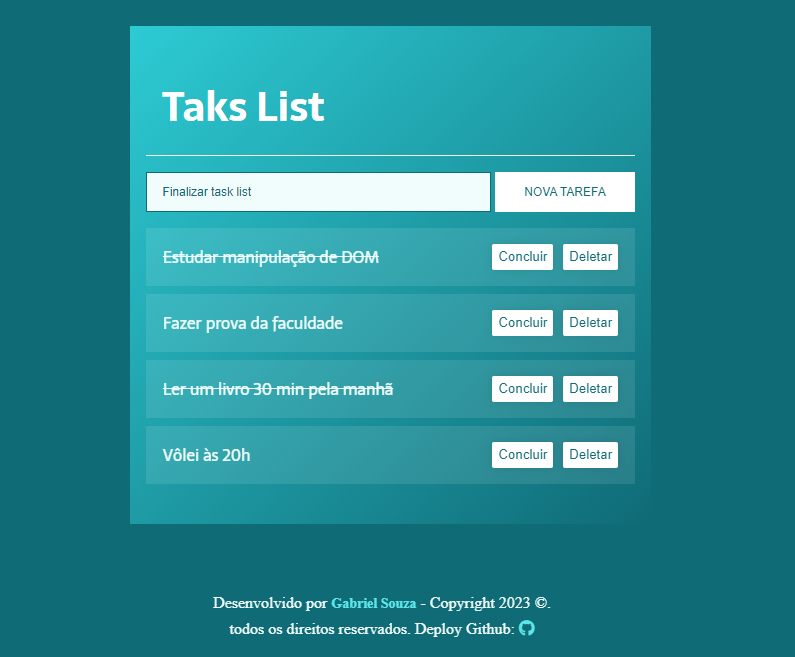

<p align="center">
  <a href="#projeto">Projeto</a>&nbsp;&nbsp;&nbsp;|&nbsp;&nbsp;&nbsp;
  <a href="#tecnologias-ferramentas">Tecnologias & Ferramentas</a>&nbsp;&nbsp;&nbsp;|&nbsp;&nbsp;&nbsp;
  <a href="#layout">Layout</a>&nbsp;&nbsp;&nbsp;|&nbsp;&nbsp;&nbsp;
  <a href="#elementosprincipais">Tópicos Abordados</a>
</p>

<h2>Sobre o projeto:</h2>

<p> Uma aplicação web de lista de tarefas/anotações onde é possível criar, finalizar ou excluir tarefas. O projeto foi desenvolvido durante a formação Front-end do Programa One - Oracle Next Education T4. O objetivo do projeto foi trabalhar e entender como funciona a manipulação do DOM (Document Object Model) com JavaScript puro. </p>

<h2 id="projeto">Apresentação do projeto:</h2> 



    - Responsivo para tablet e mobile 🔸

<h2>Sobre o desenvolvimento do projeto:</h2>

<p>Durante o desenvolvimento pude por em prática e aprimorar minhas habilidades utilizando <strong>HTML5 e algumas tags semânticas,</strong> <strong>CSS3 e uso de suas variáveis</strong> e também pude entender melhor como funciona a manipulação do DOM e aplicar a utilização de módulos e componentização em<strong> JavaScript</strong> .</p>

<h2>💻 Deploy:</h2>

- Visite o projeto online: [app-takslist](https://gabrieldev071.github.io/app-tasklist/)

<h2 id="layout">🔖 Layout:</h2> 

Foi utilizado apenas uma paleta de cores para aplicar no porjeto. Você pode visualizar a paletra de cores do projeto através [DESSE LINK](https://uicolors.app/create). A cor que deu origem a paletra de cores é #11565f.

<h2 id="elementosprincipais">Elementos principais da página:</h2>

```
[1] Um título sobre o que seria o proejeto
[2] Um forms onde é possível adicionar tarefas/anotações
[3] Após adicionar tarefas, é possível concluir ou finalizar a tarefa.
[4] Uma sessão de contato/direitos autorais (footer)
```

<p>Além disso, foi proposto um desafio nesse projeto onde precisávamos validar os campos do formulário de contato, validando se há espaços vazios ou se estavam no limite de caracteres definidos, e toda lógica foi implementada com JavaScript. Ademais, também foi feita validações pelo HTML utilizando algumas propriedades do próprio HTML como "required" e o uso do "pattern" para criar uma RegEx.</p>

<h2 id="tecnologias-ferramentas">Tecnologias & Ferramentas:</h2>


<h3>Tópicos abordados durante projeto:</h3>

- JavaScript:

        - Capturar o target do elemento html que está sendo clicado.
        - Utilização de arrow function.
        - Captura elementos html da page com querySelector através DOM.
        - Manipulação do CSS através do JS/DOM
        - Utilização de funções.
        - Utilização de condicionais if e else.
        - Manipulação string de acordo com input do usuário.
        - Explorar o uso de data-attributes para armazenar informações adicionais em elementos.
        - Utilizar import/export para importar e exportar módulos JavaScript.
        - Identificar o alvo de eventos utilizando a propriedade target.
        - Utilizar o atributo parentElement para navegar na estrutura do DOM e acessar elementos pai

- HTML5:

        - Tags como section, form, span, footer, nav, ul button, img, a,  h1, p, footer.
        - Uso padrão de nomeclatura de classes no HTML com metodologia (BEM)
        - Utilização de Custom Data Attributes para manipualção em JS. 
        - Adicionar mais de um nome de classe a um elemento html.
        - Adicionar link de fonte padrão a ser utilizada na aplicação na sessão head do index.html.
        - Adicionar link de estilos a ser utilizado na aplicação na sessão head index.html.

- CSS3:

        - Variáveis no CSS.
        - Reaproveitamenteo do código.
        - Responsividade
        - Utilização do flexbox.
        - Utilização do @import para utilizar estilos de fontes no css.
        - Utilização de pastas de midias e fotos (assets).
        - Uso de paleta de cores.
        - Utilização pseudo-elementos e pseudo-classes.
        

<h3> Badge de conclusão do projeto: </h3> 


<h3 id="contato">Minhas redes e contato: </h3> 

<a href="https://www.linkedin.com/in/gabriel-albuquerque-souza-desenvolvedor/" target="_blank" ></a>
<a href="mailto:contato_gabriel_albuquerque@hotmail.com" target="_blank" ></a>
<a href="https://www.instagram.com/gabriell.dat/" target="_blank" ></a>
<a href="https://github.com/gabrieldev071" target="_blank" ></a>


